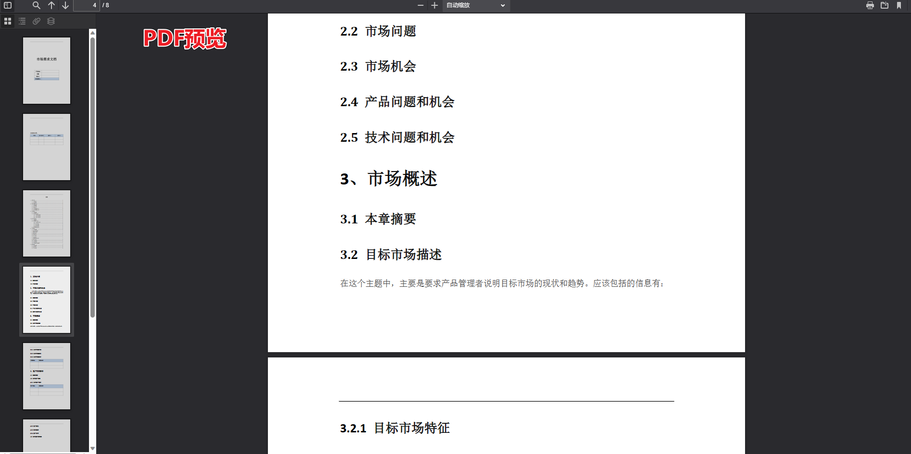

# FilePreview

FilePreview 是一个使用Vite+ React 和 PDF.js 技术构建的 Git 项目，可以在线预览各种文件格式。

同时支持移动端和PC端


## 效果预览





## 功能特点

- 可在线预览 PDF 文件
- 可在线预览 JPG、PNG 等图片文件
- 可在线预览 DOC、XLS、DOCX、PPT 等办公文件

## 使用的技术

- React：用于构建用户界面的 JavaScript 库。
- PDF.js：用于在浏览器中渲染 PDF 文件的 JavaScript 库。

## 安装说明

要在本地运行该项目，请按照以下步骤进行操作：

1. 克隆仓库：

   ```
   git clone
   ```

2. 安装依赖项：

   ```
   npm install
   ```

3. 启动开发服务器：

   ```
   npm run dev
   ```

4. 打开您的 Web 浏览器并访问

## 使用方法

一旦应用程序正在运行，您可以使用它来预览支持的文件格式。只需上传所需的文件，它将在浏览器中显示出来。

## 贡献

欢迎贡献！如果您发现任何问题或有改进建议，请随时提出新问题或提交拉取请求。

## 许可证

本项目采用 [MIT 许可证](https://chat.wuguokai.cn/LICENSE)。